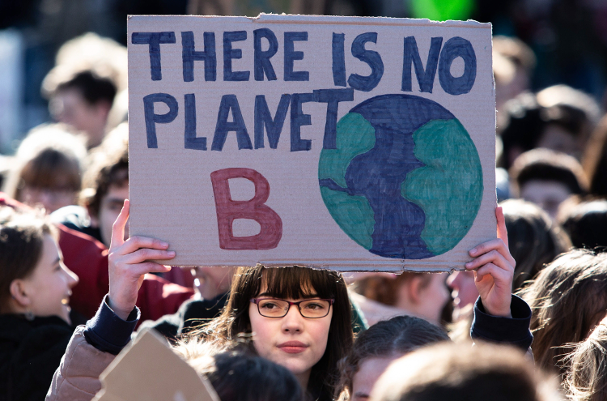
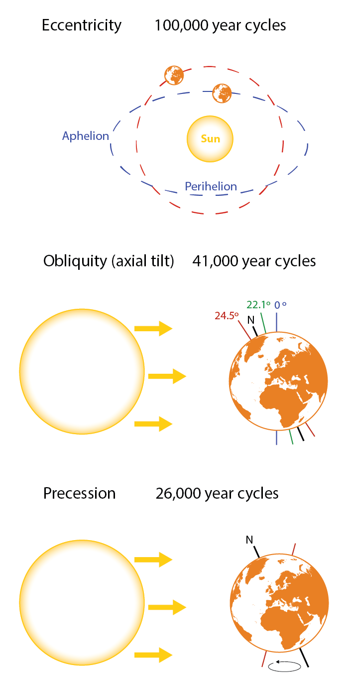
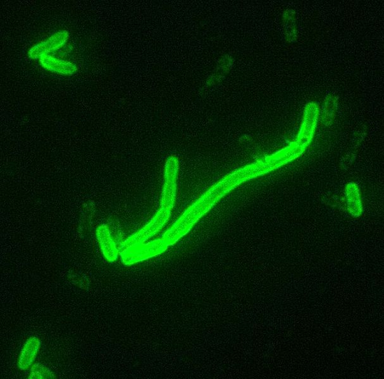

# Queridos estudiantes

El viernes 15 de marzo, como otros jóvenes de muchos países, os habéis manifestado por toda España por el medioambiente y contra el `Cambio Climático`. Os han contado que el comportamiento de los humanos desde la Revolución Industrial ha dañado al planeta, que estamos contaminando de manera irreversible el medioambiente, y que estamos modificando (a peor) el clima.

No hay planeta B, en esto estamos todos de acuerdo

Las dos primeras afirmaciones son fácilmente desmontables: por primera vez en la *Historia de la Humanidad* somos plenamente conscientes de nuestro impacto en el entorno, somos capaces de medirlo con una exactitud impensable hace tan solo unas décadas, y finalmente reducirlo al máximo posible cuando no es posible hacerlo del todo. Hay millones de ojos que vigilan para que esto sea así, es una salvaguarda que funciona de oficio desde hace décadas (no antes).

De hecho por primera vez en la historia del planeta existe una especie capaz de prevenir, o tal vez incluso detener, algunas de las catástrofes más letales que sabemos ya han producido extinciones masivas anteriormente, como por ejemplo la caída de un meteorito, o tratar pandemias que han diezmado poblaciones enteras de seres vivos, humanos o no.

Y esa especie, amigos, somos nosotros. O mejor todavía, sois vosotros y vuestros hijos y nietos que previsiblemente seréis los que vais a liderar este siglo, y conseguir que esa tendencia a mejorar sea irreversible.

Respecto a la tercera afirmación, el llamado `Cambio Climático`, se trata de un asunto un poco más delicado porque requiere cierta información previa antes de tomar partido. Y esto ocurre sobre todo por dos circunstancias en principio inconexas, pero que hay que tener muy en cuenta para acercarse racionalmente a la discusión, a saber:

1. El carácter *intrínsecamente científico* del debate, o más específicamente las peculiaridades de la propia *Climatología* como *Ciencia Natural*.
2. La *contaminación política* que ha convertido un tópico académico oscuro y altamente especializado, en una lucha partidista que está inevitablemente influida por un entramado de intereses económicos y geoestratégicos, que al final distorsiona fatalmente la percepción del público, incluyendo por supuesto la de los jóvenes.

Cuando un tema puramente científico transciende el ámbito académico y se mezcla con el debate político, se produce una distorsión que desorienta al público, que es bombardeado con información inconexa y sesgada, cuando no inexacta o directamente falsa.

A continuación se plantea en un enfoque no técnico y relativamente neutral, los puntos esenciales para tener una *opinión informada*.

# Una definición funcional de Ciencia

La primera acepción del término *Ciencia* en el diccionario de la *RAE* es la siguiente:

>Conjunto de conocimientos obtenidos mediante la observación y el razonamiento, sistemáticamente estructurados y de los que se deducen principios y leyes generales con capacidad predictiva y comprobables experimentalmente.

La cuarta acepción se refiere más específicamente al ámbito del que hablamos:

>Conjunto de conocimientos relativos a las ciencias exactas, físicas, químicas y naturales.

Y si se me permite la licencia, creo que una buena síntesis de ambas definiciones podría ser:

>**Ciencia** es el **corpus de conocimiento** basado en la observación y el razonamiento, que produce **principios** y **leyes** capaces de predecir y explicar el comportamiento de **la Naturaleza** en sus ámbitos de aplicación.

Es importante distinguir entre éste concepto de Ciencia, aplicable específicamente a las Ciencias Naturales, y la **ciencia como actividad humana**, que incluye entre otras cosas:

* lo que hacen los científicos, sus relaciones entre ellos y con la sociedad, y en general todo lo que podría considerarse como *sociología de la ciencia*;
* el análisis de las actividades investigadoras de los científicos y el estudio de las técnicas, métodos y procesos que llevan al descubrimiento y/o establecimiento de teorías, las implicaciones filosóficas de sus conclusiones, y en general aquellas áreas del conocimiento que están más bien relacionadas con la *Filosofía*, singularmente con la *Epistemología* y la *Filosofía de la Ciencia*;
* los efectos de los avances científicos sobre la sociedad, la política, la economía e incluso el medioambiente si se es capaz, y se debiera ser, de distinguir entre *ecologismo* (movimiento sociopolítico) y *Ecología* (rama de la *Biología*);
* el estudio de las *implicaciones éticas y morales* de algunos descubrimientos, teorías o conclusiones científicas, que pueden entrar en colisión con planteamientos intrínsecamente humanos.

# Climatología y Cambio climático

En los últimos años cuando hablamos de `cambio climático` no nos referimos a un área específica de la Climatología que estudia cómo y por qué cambia el clima terrestre, nos referimos solapadamente a una ensalada de hipótesis, asunciones, atribuciones y profecías que se presentan ante los ciudadanos como un *corpus de conocimiento cerrado*, sin fisuras y por tanto no susceptible de discusión, que se podría resumir básicamente en que 

> las actividades humanas derivadas de la industrialización están variando el clima del planeta, y que las proyecciones sobre el futuro son catastróficas, o en el extremo, apocalípticas.

Ante una perspectiva tan funesta, cualquier persona tiene que preguntarse si tal escenario es realmente posible. Y para ello no queda más remedio que acercarse a la disciplina que se encarga de estos temas, es decir, la *Climatología*. Al ser una disciplina científica, además de lás más áridas por sus altas dosis de matemáticas y física, es una tarea que puede resultar intimidante para la mayoría de los ciudadanos, y de hecho lo es.

Sin embargo estoy convencido de que cualquier persona curiosa, sin necesidad de conocer los detalles técnicos, las ecuaciones, los métodos, etc... si le dedica unas pocas (pero) atentas horas al `Cambio Climático`, puede obtener una más que razonable perspectiva general, y por tanto llegar a una opinión suficientemente informada.

Veamos algunos puntos importantes.

## La Climatología es inevitablemente multidisciplinar

La Climatología es la rama específica de la ciencia que estudia el clima, pero no lo hace de manera aislada, por su propia naturaleza requiere el apoyo de muchos otros campos científicos. En sus fundamentos están distintas áreas de *física fundamental y aplicada* (astronomía y astrofísica, geofísica -física de la atmósfera y oceanografía física sobre todo, meteorología, física atómica y molecular, termodinámica, dinámica de fluidos, radiación…); *geociencias* (las principales ramas de la geología quizá con mención especial a la paleontología, la estratigrafía y la glaciología; planetología, oceanografía, hidrografía, geografía física...), *química y biología* (geoquímica, bioquímica, biogeografía, ecología...); *matemáticas* (métodos estadísticos, cálculo numérico, modelización...); *ingeniería* (desde el diseño y construcción de satélites y observatorios, hasta la ingeniería de software y Big Data), e incluso en cierto modo, algunas *ciencias sociales* como la historia, la economía o la antropología.

El mundo de las Geociencias

Por tanto hay que desconfiar cuando alguien se declara experto en clima, especialmente si hace predicciones campanudas, entonces lo más probable es que sea un político o un periodista. Un científico experto será especialista en un área determinada, con un conocimiento preciso de algunas áreas contiguas y a lo sumo razonable del resto del campo. Además en general jamás disimulará éste hecho, al contrario, lo subrayará desde el principio. Si su discurso no está lleno de *condicionales*, *subjuntivos* y *adversativos*, malo, desconfía.

## El clima es un concepto intrínsecamente dinámico

Por un lado se estudia el clima presente, o mejor dicho, los diferentes climas que conocemos en la Tierra (polares, áridos, desérticos, etc... ), y por otro lado se estudia el clima en un contexto geológico y/o planetario. Por un lado se investiga las condiciones reinantes durante una determinada época, y por otro se analizan los mecanismos que producen los cambios, sean regionales o globales, y en definitiva sus causas. Eso obliga a extraer conclusiones de periodos de tiempo que en general transcienden el alcance humano, a veces hablamos del clima en cortos lapsos de tiempo (años, décadas o siglos) pero en general encontraremos que nos hablan de periodos de miles, centenares o millones de años. Hay que tener muy en cuenta además que la calidad de los datos y su resolución disminuye drásticamente según nos alejamos del presente.

Animación de la NASA de la Tierra vista desde satélites entre 1997 y 2017

Esto implica que para probar hipótesis (por ejemplo que las *actividades humanas* podrían causar o estar causando ya un calentamiento peligroso) se necesiten décadas de recolección y análisis de datos para poder extraer conclusiones certeras primero, y predicciones fiables después de que nuestros modelos sean testados, es decir, una vez hayan sido validados por la propia *Naturaleza*.

## La climatología es una ciencia observacional

Como pasa con otras ciencias en las que el acceso a la experimentación está restringido o es directamente inaccesible (piensa en la astronomía, la geología, o las ciencias sociales), toda la información a la que podemos acceder es mediante la observación del presente y el análisis de la información de la que disponemos del pasado. Tenemos datos fiables de las últimas décadas, relativamente buenos de los últimos siglos, aceptablemente fiables desde la última glaciación (durante *el Holoceno*), y cada vez más discutibles en cuanto a precisión (en cualquier variable dada, sea la temperatura global, el pH oceánico o las precipitaciones, por ejemplo) y a resolución temporal (que puede oscilar incluso millones de años antes o después de un momento dado).

Hay que tener en cuenta que la información que recolectamos es siempre indirecta, las dataciones no son igual de precisas dependiendo de la variable a medir, las diferentes metodologías tienen un carácter local que implica un proceso extra para inferir el valor de las variables globales, y el tratamiento matemático de las incertidumbres está lejos de ser trivial o proporcionar valores fiables. Esto lleva a que sea habitual que diferentes autores lleguen a resultados distintos incluso con los mismos datos, o que sustanciales cambios se produzcan tras reanálisis por otros autores o equipos, algo que a su vez abre puertas a diferentes interpretaciones posibles.

Las burbujas de aire atrapadas en las muestras de hielo antártico son un método fiable para inferir la concentración de gases en la atmósfera hace cientos o miles de años

Los científicos han aprendido mucho durante los últimos siglos, son muy hábiles a la hora de evitar el autoengaño, y lo primero que analizan siempre son las limitaciones de sus modelos y las lagunas conceptuales o prácticas de sus estudios. Así que de nuevo, cuando alguien ofusca esta realidad respecto a la incertidumbre en sus conclusiones, o de sus predicciones, desconfía automáticamente.

## La climatología no es predictiva, de momento

Estamos lejos de ser capaces de modelar un sistema como el del clima terrestre con el suficiente grado de fiabilidad como para producir predicciones razonablemente precisas. Hay fenómenos climatológicos que sabemos fehacientemente que se producen con una cierta periodicidad, incluso a la escala humana (por ejemplo fenómenos como *el Niño* y *la Niña* -ENSO- cada pocos años, o la Oscilación del Pacífico Norte -PDO- cada pocas décadas), pero estamos lejos de tener certeza sobre los mecanismos que los determinan, y por tanto de predecirlos.

Y la cosa empeora a largo plazo (miles o decenas de años, millones de años...). Por ejemplo *se sabe* que padeceremos otra glaciación, incluso hay diferentes líneas de evidencia que apuntan a que estas *edades de hielo* están relacionadas con variaciones en la órbita de la Tierra (*ciclos de Milanković*), que producen cambios en la cantidad de energía que nos llega del sol. Sin embargo, de ahí a predecirlas hay un trecho, y a comprobar nuestra predicción dentro de 1000, 10000 0 50000 años, otro, éste además insalvable.

Los ciclos de Milankovitch un ejemplo de mecanismo conocido relacionado con la alternancia de periodos cálidos y gélidos del planeta Tierra

Pero no me mal entendáis, muchas otras ciencias son bien dignas sin hacer predicciones, o haciendo pronósticos poco precisos, o vagos, o incluso fallando miserablemente. Les pasa a todas las Ciencias Sociales, y les pasa y les ha pasado a muchas áreas de la biología, la geología, la química o incluso de la física. No poder hacer predicciones no elimina la validez de una ciencia. Simular que las predicciones son fiables sí. Y eso está menos relacionado con la Ciencia y más relacionado con la contaminación política de la que hablaremos en el siguiente punto.

Por tanto las críticas a algunas posiciones del debate no significan en modo alguno una crítica general a la *Climatología*, ni siquiera una deslegitimación del estudio del `Cambio Climático`. Es más, habría que añadir que gracias al inmenso desarrollo tecnológico realizado durante el último siglo, especialmente gracias a la teledetección y a la enorme (y sin embargo creciente) capacidad de cálculo de nuestros ordenadores, añadido al gran número de entidades que se han especializado en analizar este tipo de información, no es exagerado pensar que en las próximas décadas podamos alcanzar conclusiones mucho más sólidas que las que tenemos ahora, y quizás, con el tiempo, incluso podríamos ser capaces de predecir y parcialmente controlar el clima terrestre.

## El Cambio Climático es la rama política de la Ciencia del Clima

Desde tiempos de *Platón*, sabemos que *la política* es una noble actividad humana que es inevitable debido a que el ser humano es un *ser social* por naturaleza, lo cual lleva al surgimiento de comunidades de individuos, aldeas, ciudades, estados... Aunque compartimos un origen y un destino común, y unos planteamientos morales similares que podrían quedar sintetizados en el *Derecho Natural*, somos lo suficientemente heterogéneos como para tener diferentes sensibilidades para diferentes problemas, más allá de las diversas culturas, generaciones y filosofías que compartimos el planeta en un momento dado. Podríamos entonces considerar que la política es el arte de armonizar esta realidad promoviendo la convivencia entre ciudadanos y garantizando en lo posible el buen gobierno de sus líderes.

Desde un punto de vista más prosaico, debemos considerar también que la política es el oficio de alcanzar y mantener el poder, controlar los recursos y dirigir la economía. Estas actividades no siempre son transparentes, nobles o justas, y la ideología es frecuentemente más una coartada que una motivación real, y desde luego una herramienta de control de masas que socava nuestra libertad.

*La Ciencia* debería ser inmune a las intrigas políticas, y lo es de hecho en la definición a la que me refería al principio, es decir, la Ciencia considerada como *corpus de conocimiento*. Por tanto podríamos decir que *la Climatología* está a salvo de la política, sigue su camino, sus métodos, y continua observando la naturaleza, analizando datos, buscando patrones y estableciendo mecanismos que expliquen de la manera más precisa posible el funcionamiento del *clima de la Tierra*. Es un trabajo minucioso, altamente especializado, puramente científico y, en esencia, desligado de las interferencias políticas y sociales.

Otra cosa es el `Cambio Climático`. Si como propongo, consideramos que en realidad se trata de la vertiente política de la *Ciencia del Clima*, es inmediato entender por qué conceptos totalmente ajenos al *método científico* como son *el consenso* o *la retórica*, o prácticas tan incompatibles con la ciencia como son *la manipulación* o *la propaganda*, aparecen continuamente en el debate público y en los medios de comunicación.

Y esto no es un simple detalle, es un cambio radical en la arena del debate, la ciencia deja de ser ciencia y se transforma en una simple herramienta política más. Cuando esto es asumido, en definitiva, cuando sacrificamos el rigor argumental (regido casi exclusivamente por la lógica y por el método científico de las Ciencias Naturales), nos alejamos del terreno puramente técnico, pero paradójicamente se abre a su vez la puerta a que el ciudadano común pueda (*tenga derecho a*) y deba (*tenga capacidad para*) posicionarse en base a racionamientos más mundanos como son el *sentido común*, la *intuición*, o la *calidad moral* de las propuestas y los métodos de las partes.

# Cambio Climático y sentido común

Si buscas en cualquier diccionario filosófico encontrarás que el *sentido común* se puede definir por ejemplo como:

>Conjunto de ideas, hábitos y formas de pensar que el hombre ha elaborado en su actividad práctica cotidiana.

Aunque los científicos no son ajenos a esta forma de pensar, de hecho suelen hacer buen uso del *sentido común* en sus tareas investigadoras, la Ciencia es perfectamente independiente de él, y *la Naturaleza* nos ha enseñado en múltiples ocasiones que prescinde absolutamente de los paradigmas humanos, que tiene su propia forma de funcionamiento, en ocasiones extraordinariamente intrincada y contraintuitiva, y que al final es *Ella* la que tiene la última palabra.

# Reflexiones y conclusión

Como escribía al principio, somos la primera especie del planeta que es capaz de prevenir y eventualmente eliminar algunas de las mayores catástrofes que ha sufrido el planeta (o sus huéspedes) a lo largo de la historia geológica. Algunas, pero no todas. Tenemos que entender nuestra insignificancia en términos geológicos (no digamos en tiempos cosmológicos), y que vivimos en universo y en un planeta en los que el riesgo de hecatombe es pequeño pero no *CERO*. Por ejemplo:

* Sabemos que *el Sol* agotará su hidrógeno, se convertirá en una *gigante roja* y desintegrará sin piedad todo vestigio de vida en la Tierra, si es que para entonces (dentro de 5000 millones de años) subsiste alguna especie por aquí. Después pasarán más cosas pero nadie estará aquí para comprobarlas. Es de suponer que si todo va bien y sobrevivimos lo suficiente, a esas alturas hayamos encontrado ya otros planetas u otra modelos de subsistencia como especie en éste universo.
* Los *impactos de asteroides* son habituales en todos los planetas, y aunque la gran mayoría de ellos son irrelevantes para la vida, sabemos que en la Tierra se han producido eventos que han provocado extinciones masivas (por ejemplo buscad la *extinción del Cretácico-Paleógeno* hace 65 millones de años) y es de esperar de que esto vuelva a suceder en el futuro. Que podamos salir de éste apuro dependerá en buena parte del tamaño del asteroide y del nivel tecnológico alcanzado por los humanos para cuando suceda.
* Una *pandemia letal*, sea regional o global, es también un escenario posible, hemos tenido episodios graves que llegaron a eliminar a cerca de la mitad de la población de Europea durante la *Peste Negra*, a mediados del siglo XIV.

La bacteria Yersinia pestis es responsable de diferentes variedades de peste y cuenta con centenares de millones de vidas humanas a sus espaldas, sin contar otras especies vulnerables

* Episodios de origen tectónico como los *volcanes*, los *terremotos* y los *tsunamis*, han causado millones y millones de víctimas a lo largo de la historia, tanto humana como geológica, e igual que ocurre con el clima, estamos lejos (aunque seguramente cada vez más cerca) de ser capaces de preverlos.
* *El ser humano* en sí mismo es ya sin duda una especie lo suficientemente avanzada para auto-destruirse, el riesgo de *guerra nuclear* no ha sido superado del todo (todavía hay miles de ojivas, la mayoría repartidas entre EEUU y Rusia), o el de creación de *bacterias mortíferas* en laboratorio que puedan ser difundidas por el planeta, accidentalmente o no. Seguramente habrá otros escenarios, para bien y para mal los humanos tenemos acreditada una gran imaginación y no poco ingenio. Pero honestamente, creo que obsesionarse con estas posibilidades es improductivo para el ciudadano de a pie, y creo que una actitud más positiva y cierto *optimismo antropológico* es mucho más razonable, y seguramente también, mucho más saludable.
* Un *cambio climático abrupto* podría ocurrir en 100 años o en 20000, puede pasar, y no necesariamente provocado por los seres humanos (de hecho esto es bastante improbable). Sin embargo el sentido común nos dicta que para la mayor parte de los seres vivos, incluido nosotros, será más fácil adaptarse a una subida global de la temperatura de unos pocos grados (por ejemplo 2 o 3 ºC sobre la temperatura global media que pensamos había en 1800), que a una glaciación que nos llevará a una drástica caída de 10 o más ºC en la temperatura media, y a una buena porción del planeta congelado.

En cualquiera de los casos anteriores, u otros que no podemos ni pensar ahora, de lo que no hay duda es de que estamos mucho mejor preparados hoy para afrontar cualquier cataclismo, e idealmente evitarlo, que hace tres siglos cuando nuestras emisiones de gases invernadero eran prácticamente cero.

Por eso no hay nada más importante para el planeta, y para todos sus moradores, que los seres humanos sigamos avanzando como especie, sigamos cultivando la Ciencia, y no nos dejemos llevar por dogmatismos e ideologías sectarias o deshumanizadoras, y no caigamos en posiciones maximalistas y extremismos. El planeta será más vulnerable cuanto más vulnerables seamos los seres humanos.

Por tanto queridos jóvenes, ser escéptico respecto al alarmismo climático y a las soluciones que algunos proponen, es esféricamente racional, perfectamente moral y fácilmente defendible si consigues no dejarte amedrentar por las falacias de autoridad (lo dicen *los científicos*) que al final es el único argumento que se maneja en la arena del `Cambio Climático`.

# Sobre este escrito

Aunque el título indica que es una carta a los estudiantes, la redacción está enfocada para que sirva de introducción para cualquier individuo sin formación técnica. Creo honestamente que cualquier persona con una cultura media, y a partir de cierto umbral de pensamiento crítico, debe ser capaz de tener una idea razonablemente precisa de la esencia del debate y de sus claves, y por tanto debería ser lo suficientemente equilibrado como para situarse en el lado correcto del debate, que desde luego no es el frente alarmista.

He evitado llenar el artículo de enlaces y referencias porque he querido mantener un formato epistolar limpio y sin distracciones, pero desde luego invito al lector que investigue sobre los conceptos, hechos y terminologías que aparecen en el texto.

Muchas gracias por leer.

Eclectikus
