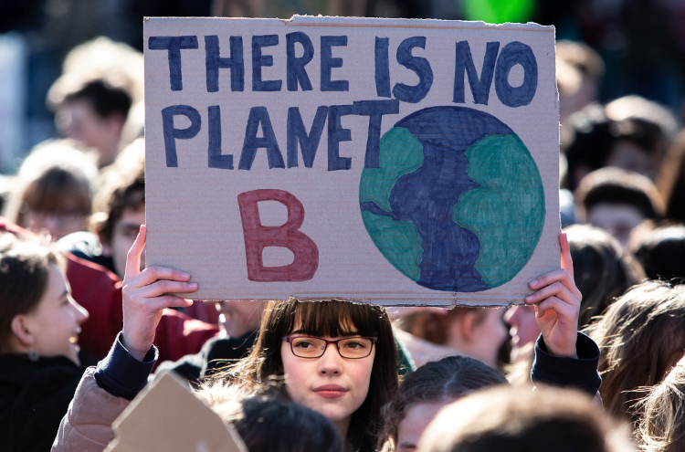
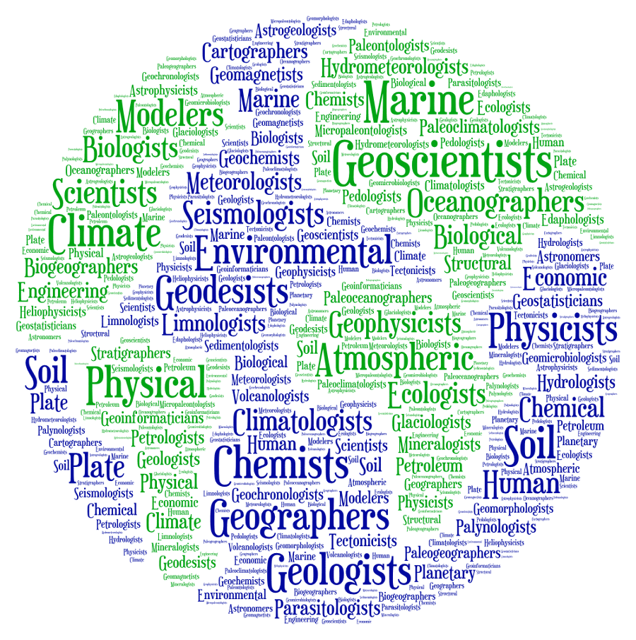
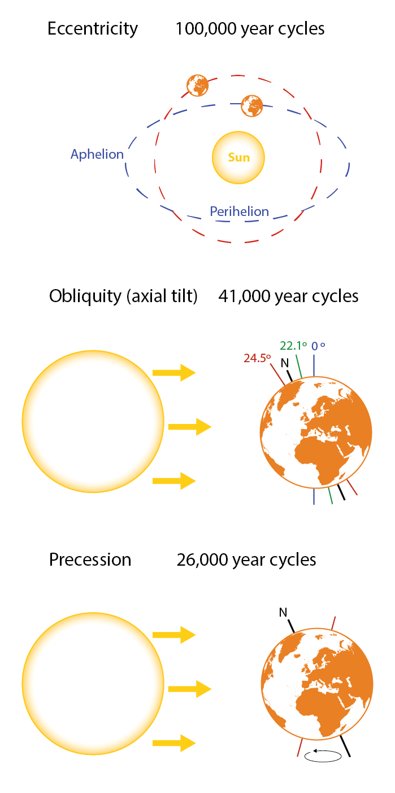
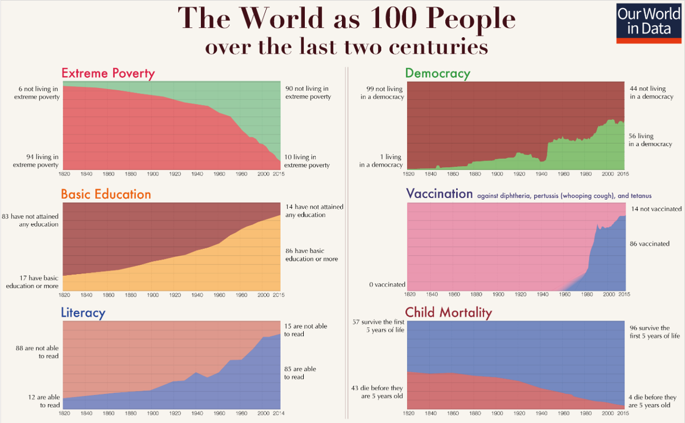
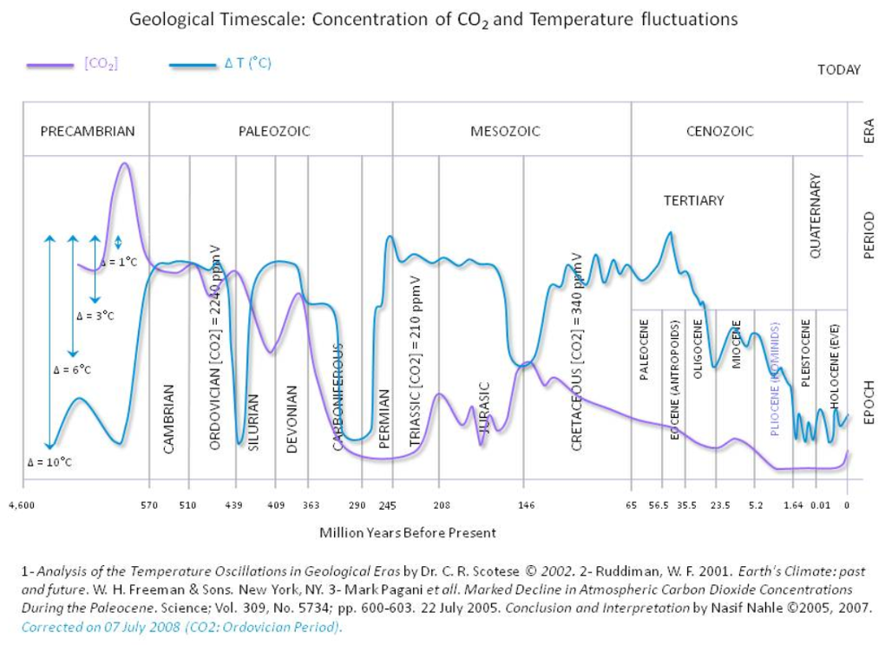
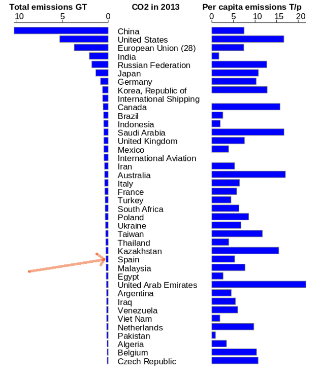
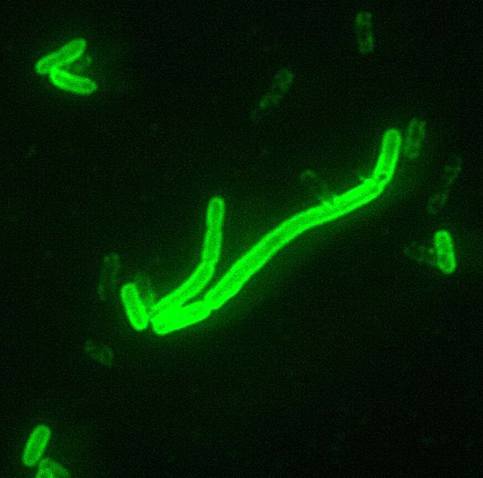

```{r setup, include=FALSE}
library(plyr)
library(ggpubr)
library(rmarkdown)
library(knitr)
library(kableExtra)
library(ggthemes)
library(reshape2)
library(gridExtra)
library(magrittr)
library(ggplot2)
library(xkcd)
library(extrafont)
library(utf8)
library(treemapify)
library(png)
```

# Queridos estudiantes

[](https://github.com/Eclectikus/cartaestudiantesccc)
[](https://eclectikus.github.io/cartaestudiantesccc/)

El viernes 15 de marzo, como otros jóvenes de muchos países, os habéis manifestado por toda España por el medioambiente y contra el `Cambio Climático`. Os han contado que el comportamiento de los humanos desde la Revolución Industrial ha dañado al planeta, que estamos contaminando de manera irreversible el medioambiente, y que estamos modificando (a peor) el clima.

```{r planetB, echo=FALSE, fig.align='center', fig.cap="No hay planeta B, en esto estamos todos de acuerdo", out.width=420}

```

Las dos primeras afirmaciones son fácilmente desmontables: por primera vez en la *Historia de la Humanidad* somos plenamente conscientes de nuestro impacto en el entorno, somos capaces de medirlo con una exactitud impensable hace tan solo unas décadas, y finalmente reducirlo al máximo posible cuando no es posible hacerlo del todo. Hay millones de ojos que vigilan para que esto sea así, es una salvaguarda que funciona de oficio desde hace décadas (no antes).

De hecho por primera vez en la historia del planeta existe una especie capaz de prevenir, o tal vez incluso detener, algunas de las catástrofes más letales que sabemos ya han producido extinciones masivas anteriormente, como por ejemplo la caída de un meteorito, o tratar pandemias que han diezmado poblaciones enteras de seres vivos, humanos o no.

Y esa especie, amigos, somos nosotros. O mejor todavía, sois vosotros y vuestros hijos y nietos que previsiblemente seréis los que vais a liderar este siglo, y conseguir que esa tendencia a mejorar sea irreversible.

Respecto a la tercera afirmación, el llamado `Cambio Climático`, se trata de un asunto un poco más delicado porque requiere cierta información previa antes de tomar partido. Y esto ocurre sobre todo por dos circunstancias en principio inconexas, pero que hay que tener muy en cuenta para acercarse racionalmente a la discusión, a saber:

1. El carácter *intrínsecamente científico* del debate, o más específicamente las peculiaridades de la propia *Climatología* como *Ciencia Natural*.
2. La *contaminación política* que ha convertido un tópico académico oscuro y altamente especializado, en una lucha partidista que está inevitablemente influida por un entramado de intereses económicos y geoestratégicos, que al final distorsiona fatalmente la percepción del público, incluyendo por supuesto la de los jóvenes.

Cuando un tema puramente científico transciende el ámbito académico y se mezcla con el debate político, se produce una distorsión que desorienta al público, que es bombardeado con información inconexa y sesgada, cuando no inexacta o directamente falsa.

A continuación se plantea en un enfoque no técnico y relativamente neutral, los puntos esenciales para tener una *opinión informada*.

# Una definición funcional de Ciencia

La primera acepción del término *Ciencia* en el diccionario de la *RAE* es la siguiente:

>Conjunto de conocimientos obtenidos mediante la observación y el razonamiento, sistemáticamente estructurados y de los que se deducen principios y leyes generales con capacidad predictiva y comprobables experimentalmente.

La cuarta acepción se refiere más específicamente al ámbito del que hablamos:

>Conjunto de conocimientos relativos a las ciencias exactas, físicas, químicas y naturales.

Y si se me permite la licencia, creo que una buena síntesis de ambas definiciones podría ser:

>**Ciencia** es el **corpus de conocimiento** basado en la observación y el razonamiento, que produce **principios** y **leyes** capaces de predecir y explicar el comportamiento de **la Naturaleza** en sus ámbitos de aplicación.

Es importante distinguir entre éste concepto de Ciencia, aplicable específicamente a las Ciencias Naturales, y la **ciencia como actividad humana**, que incluye entre otras cosas:

* lo que hacen los científicos, sus relaciones entre ellos y con la sociedad, y en general todo lo que podría considerarse como *sociología de la ciencia*;
* el análisis de las actividades investigadoras de los científicos y el estudio de las técnicas, métodos y procesos que llevan al descubrimiento y/o establecimiento de teorías, las implicaciones filosóficas de sus conclusiones, y en general aquellas áreas del conocimiento que están más bien relacionadas con la *Filosofía*, singularmente con la *Epistemología* y la *Filosofía de la Ciencia*;
* los efectos de los avances científicos sobre la sociedad, la política, la economía e incluso el medioambiente si se es capaz, y se debiera ser, de distinguir entre *ecologismo* (movimiento sociopolítico) y *Ecología* (rama de la *Biología*);
* el estudio de las *implicaciones éticas y morales* de algunos descubrimientos, teorías o conclusiones científicas, que pueden entrar en colisión con planteamientos intrínsecamente humanos.

# Climatología y Cambio climático

En los últimos años cuando hablamos de `cambio climático` no nos referimos a un área específica de la Climatología que estudia cómo y por qué cambia el clima terrestre, nos referimos solapadamente a una ensalada de hipótesis, asunciones, atribuciones y profecías que se presentan ante los ciudadanos como un *corpus de conocimiento cerrado*, sin fisuras y por tanto no susceptible de discusión, que se podría resumir básicamente en que 

> las actividades humanas derivadas de la industrialización están variando el clima del planeta, y que las proyecciones sobre el futuro son catastróficas, o en el extremo, apocalípticas.

Ante una perspectiva tan funesta, cualquier persona tiene que preguntarse si tal escenario es realmente posible. Y para ello no queda más remedio que acercarse a la disciplina que se encarga de estos temas, es decir, la *Climatología*. Al ser una disciplina científica, además de lás más áridas por sus altas dosis de matemáticas y física, es una tarea que puede resultar intimidante para la mayoría de los ciudadanos, y de hecho lo es.

Sin embargo estoy convencido de que cualquier persona curiosa, sin necesidad de conocer los detalles técnicos, las ecuaciones, los métodos, etc... si le dedica unas pocas (pero) atentas horas al `Cambio Climático`, puede obtener una más que razonable perspectiva general, y por tanto llegar a una opinión suficientemente informada.

Veamos algunos puntos importantes.

## La Climatología es inevitablemente multidisciplinar

La Climatología es la rama específica de la ciencia que estudia el clima, pero no lo hace de manera aislada, por su propia naturaleza requiere el apoyo de muchos otros campos científicos. En sus fundamentos están distintas áreas de *física fundamental y aplicada* (astronomía y astrofísica, geofísica -física de la atmósfera y oceanografía física sobre todo, meteorología, física atómica y molecular, termodinámica, dinámica de fluidos, radiación…); *geociencias* (las principales ramas de la geología quizá con mención especial a la paleontología, la estratigrafía y la glaciología; planetología, oceanografía, hidrografía, geografía física...), *química y biología* (geoquímica, bioquímica, biogeografía, ecología...); *matemáticas* (métodos estadísticos, cálculo numérico, modelización...); *ingeniería* (desde el diseño y construcción de satélites y observatorios, hasta la ingeniería de software y Big Data), e incluso en cierto modo, algunas *ciencias sociales* como la historia, la economía o la antropología.

```{r geociencias, echo=FALSE, fig.align='center', fig.cap="El mundo de las Geociencias", out.width=480}

```

Por tanto hay que desconfiar cuando alguien se declara experto en clima, especialmente si hace predicciones campanudas, entonces lo más probable es que sea un político o un periodista. Un científico experto será especialista en un área determinada, con un conocimiento preciso de algunas áreas contiguas y a lo sumo razonable del resto del campo. Además en general jamás disimulará éste hecho, al contrario, lo subrayará desde el principio. Si su discurso no está lleno de *condicionales*, *subjuntivos* y *adversativos*, malo, desconfía.

## El clima es un concepto intrínsecamente dinámico

Por un lado se estudia el clima presente, o mejor dicho, los diferentes climas que conocemos en la Tierra (polares, áridos, desérticos, etc... ), y por otro lado se estudia el clima en un contexto geológico y/o planetario. Por un lado se investiga las condiciones reinantes durante una determinada época, y por otro se analizan los mecanismos que producen los cambios, sean regionales o globales, y por tanto sus causas. Eso obliga a extraer conclusiones de periodos de tiempo que en general transcienden el alcance humano, a veces hablamos del clima en cortos lapsos de tiempo (años, décadas o siglos) pero en general encontraremos que nos hablan de periodos de miles, centenares o millones de años. Hay que tener muy en cuenta además que la calidad de los datos y su resolución disminuye drásticamente según nos alejamos del presente.

```{r nasagif, echo=FALSE, fig.align='center', fig.cap="Animación de la NASA de la Tierra vista desde satélites entre 1997 y 2017", out.width=480}
knitr::include_graphics("figure/EO_Topicsmollweidecycle.gif")
```

Esto implica que para probar hipótesis (por ejemplo que las *actividades humanas* podrían causar o estar causando ya un calentamiento peligroso) se necesiten décadas de recolección y análisis de datos para poder extraer conclusiones certeras primero, y predicciones fiables después de que nuestros modelos sean testados, es decir, una vez hayan sido validados por la propia *Naturaleza*.

## La climatología es una ciencia observacional

Como pasa con otras ciencias en las que el acceso a la experimentación está restringido o es directamente inaccesible (piensa en la astronomía, la geología, o las ciencias sociales), toda la información a la que podemos acceder es mediante la observación del presente y el análisis de la información de la que disponemos del pasado. Tenemos datos fiables de las últimas décadas, relativamente buenos de los últimos siglos, aceptablemente fiables desde la última glaciación (durante *el Holoceno*), y cada vez más discutibles en cuanto a precisión (en cualquier variable dada, sea la temperatura global, el pH oceánico o las precipitaciones, por ejemplo) y a resolución temporal (que puede oscilar incluso millones de años antes o después de un momento dado).

Hay que tener en cuenta que la información que recolectamos es siempre indirecta, las dataciones no son igual de precisas dependiendo de la variable a medir, las diferentes metodologías tienen un carácter local que implica un proceso extra para inferir el valor de las variables globales, y el tratamiento matemático de las incertidumbres está lejos de ser trivial o proporcionar valores fiables. Esto lleva a que sea habitual que diferentes autores lleguen a resultados distintos incluso con los mismos datos, o que sustanciales cambios se produzcan tras reanálisis por otros autores o equipos, algo que a su vez abre puertas a diferentes interpretaciones posibles.

```{r burbujas, echo=FALSE, fig.align='center', fig.cap="Las burbujas de aire atrapadas en las muestras de hielo antártico son un método fiable para inferir la concentración de gases en la atmósfera hace cientos o miles de años", out.width=420}

```

Los científicos han aprendido mucho durante los últimos siglos, son muy hábiles a la hora de evitar el autoengaño, y lo primero que analizan siempre son las limitaciones de sus modelos y las lagunas conceptuales o prácticas de sus estudios. Así que de nuevo, cuando alguien disimule las incertidumbres y los puntos flacos de su teoría, o de sus conclusiones, o de sus predicciones, desconfía automáticamente.

## La climatología no es predictiva, de momento

Estamos lejos de ser capaces de modelar un sistema como el del clima terrestre con el suficiente grado de fiabilidad como para producir predicciones razonablemente precisas. Hay fenómenos climatológicos que sabemos fehacientemente que se producen con una cierta periodicidad, incluso a la escala humana (por ejemplo fenómenos como *el Niño* y *la Niña* -ENSO- cada pocos años, o la Oscilación del Pacífico Norte -PDO- cada pocas décadas), pero estamos lejos de tener certeza sobre los mecanismos que los determinan, y por tanto de predecirlos.

Y la cosa empeora a largo plazo (miles o decenas de años, millones de años...). Por ejemplo *se sabe* que padeceremos otra glaciación, incluso hay diferentes líneas de evidencia que apuntan a que estas *edades de hielo* están relacionadas con variaciones en la órbita de la Tierra (*ciclos de Milanković*), que producen cambios en la cantidad de energía que nos llega del sol. Sin embargo, de ahí a predecirlas hay un trecho, y a comprobar nuestra predicción dentro de 1000, 10000 0 50000 años, otro, éste además insalvable.

```{r Milankovitch, echo=FALSE, fig.align='center', fig.cap="Los ciclos de Milankovitch, un ejemplo de mecanismo conocido relacionado con la alternancia de periodos cálidos y gélidos del planeta Tierra", out.width=420}

```

Pero no me mal entendáis, muchas otras ciencias son bien dignas sin hacer predicciones, o haciendo pronósticos poco precisos, o especulativos, o incluso fallando miserablemente. Les pasa a todas las Ciencias Sociales, y les pasa y les ha pasado a muchas áreas de la biología, la geología, la química o incluso de la física. No poder hacer predicciones no elimina la validez de una ciencia. Simular que las predicciones son fiables sí. Y eso está menos relacionado con *la Ciencia* y más relacionado con la *contaminación política* de la que hablaremos en el siguiente punto.

Por tanto las críticas a algunas posiciones del debate no significan en modo alguno una crítica general a la *Climatología*, ni siquiera una deslegitimación del estudio del `Cambio Climático`. Es más, habría que añadir que gracias al inmenso desarrollo tecnológico realizado durante el último siglo, especialmente gracias a la teledetección y a la enorme (y sin embargo creciente) capacidad de cálculo de nuestros ordenadores, añadido al gran número de entidades que se han especializado en analizar este tipo de información, no es exagerado pensar que en las próximas décadas podamos alcanzar conclusiones mucho más sólidas que las que tenemos ahora, y quizás, con el tiempo, incluso podríamos ser capaces de predecir y parcialmente controlar el clima terrestre.

## El Cambio Climático es la rama política de la Ciencia del Clima

Desde tiempos de *Platón*, sabemos que *la política* es una noble actividad humana que es inevitable debido a que el ser humano es un *ser social* por naturaleza, lo cual lleva al surgimiento de comunidades de individuos, aldeas, ciudades, estados... Aunque compartimos un origen y un destino común, y unos planteamientos morales similares que podrían quedar sintetizados en el *Derecho Natural*, somos lo suficientemente heterogéneos como para tener diferentes sensibilidades para diferentes problemas, más allá de las diversas culturas, generaciones y filosofías que compartimos el planeta en un momento dado. Podríamos entonces considerar que la política es el arte de armonizar esta realidad promoviendo la convivencia entre ciudadanos y garantizando en lo posible el buen gobierno de sus líderes.

Desde un punto de vista más prosaico, debemos considerar también que la política es el oficio de alcanzar y mantener el poder, controlar los recursos y dirigir la economía. Estas actividades no siempre son transparentes, nobles o justas, y la ideología es frecuentemente más una coartada que una motivación real, y desde luego una herramienta de control de masas que socava nuestra libertad.

*La Ciencia* debería ser inmune a las intrigas políticas, y lo es de hecho en la definición a la que me refería al principio, es decir, la Ciencia considerada como *corpus de conocimiento*. Por tanto podríamos decir que *la Climatología* está a salvo de la política, sigue su camino, sus métodos, y continua observando la naturaleza, analizando datos, buscando patrones y estableciendo mecanismos que expliquen de la manera más precisa posible el funcionamiento del *clima de la Tierra*. Es un trabajo minucioso, altamente especializado, puramente científico y, en esencia, desligado de las interferencias políticas y sociales.

Otra cosa es el `Cambio Climático`. Si como propongo, consideramos que en realidad se trata de la vertiente política de la *Ciencia del Clima*, es inmediato entender por qué conceptos totalmente ajenos al *método científico* como son *el consenso* o *la retórica*, o prácticas tan incompatibles con la ciencia como son *la manipulación* o *la propaganda*, aparecen continuamente en el debate público y en los medios de comunicación.

Y esto no es un simple detalle, es un cambio radical en la arena del debate, la ciencia deja de ser ciencia y se transforma en una simple herramienta política más. Cuando esto es asumido, en definitiva, cuando sacrificamos el rigor argumental (regido casi exclusivamente por la lógica y por el método científico de las Ciencias Naturales), nos alejamos del terreno puramente técnico, pero paradójicamente se abre a su vez la puerta a que el ciudadano común pueda (*tenga derecho a*) y deba (dado que *tiene capacidad para*) posicionarse en base a racionamientos más mundanos como son el *sentido común*, la *intuición*, o la *calidad moral* de las propuestas y los métodos de las partes.

# Cambio Climático y sentido común

Si buscas en cualquier diccionario filosófico encontrarás que el *sentido común* se puede definir por ejemplo como:

>Conjunto de ideas, hábitos y formas de pensar que el hombre ha elaborado en su actividad práctica cotidiana.

Aunque los científicos no son ajenos a esta componente del pensamiento, de hecho suelen hacer buen uso del *sentido común* en sus tareas investigadoras, la Ciencia es perfectamente independiente de él, y *la Naturaleza* nos ha enseñado en múltiples ocasiones que ignora absolutamente los paradigmas humanos, que tiene su propia forma de funcionamiento, en ocasiones extraordinariamente intrincada y contraintuitiva, y que al final es *Ella* la que tiene la última palabra.

Pero tampoco podemos esperar a que la Ciencia tenga una respuesta precisa y diáfana de la realidad, o que esta sea accesible para los legos. A menudo tenemos que tomar decisiones sin información suficiente, sin conocimiento de los detalles técnicos, entonces configuramos nuestra forma de pensar en los parámetros que nos dicta nuestra experiencia, la lógica, y si, también "el sentido común".

A continuación vienen unas pocas preguntas que se enmarcan en esa línea de razonamiento.

## ¿Por qué se ocultan los avances de los últimos 2 siglos?

Cuando se critican los efectos perniciosos de la revolución industrial del siglo XVIII, y más solapadamente los de la revolución tecnológica del siglo XX, ¿por qué se omiten impunemente las impresionantes ventajas que nos han traído? No es posible hacer un balance equitativo si la balanza no tiene dos brazos, uno para los inconvenientes, y otro para ventajas innegables como estas:

```{r 2siglos, echo=FALSE, fig.align='center', fig.cap="Los últimos dos siglos han sido especialmente turbulentos, pero han sido también muy productivos.", out.width=630}

```

## ¿Por qué se confunde contaminación y cambio climático?

La contaminación es el principal peaje que pagamos por nuestro modelo de sociedad. Hace décadas que sabemos que la actitud más inteligente es vigilar, controlar, procesar, reciclar y minimizar nuestros deshechos. Y eso hacemos.

Cuando se incluyen las emisiones humanas de `CO2` como contaminantes, se está asumiendo que la hipótesis de que el calentamiento provocado por estas (muy difícil de medir, si es que se puede medir) es apocalíptico. Y a la vez se está ocultando:

1. Que el `CO2` antrópico es un pequeño porcentaje del `CO2` "*natural*", que a su vez es un pequeño porcentaje de los *gases de efecto invernadero*, que son un pequeño porcentaje de la composición de *la atmósfera*, la cual es una parte fundamental pero no única del sistema climático terrestre.

2. El `CO2` es un gas esencial para muchos de los organismos con los que compartimos el planeta, y es especialmente beneficioso para el *mundo vegetal*. La concentración en la atmósfera de este gas está alrededor de `400 ppm` (`250-350 ppm` al aire libre), más cerca del mínimo necesario para que respiren (y por lo tanto existan) las plantas (~ `150 ppm`), que de la concentración habitual en una cafetería (~ `1000 ppm`), por no hablar de concentraciones que podríamos considerar tóxicas (a partir de `70000 ppm`).

3. La concentración de `CO2`en la atmósfera está mucho más cerca pues del mínimo necesario para la vida que de valores que pudiéramos considerar peligrosos. Y muy lejos de los máximos alcanzados a lo largo de la historia del planeta, singularmente los valores que hubo en momentos claves para el desarrollo de la vida como fue la *explosión cámbrica* hace 540 millones de años.

```{r co2yt, echo=FALSE, fig.align='center', fig.cap="La tierra aguanta muy bien temperaturas más altas y más bajas, y también concentraciones de CO2 mucho más altas", out.width=630}

```

Por tanto, hay que insistir porque esto pasa siempre desapercibido en los medios:

> cuando se considera alegremente al `CO2` como un contaminante más porque produce un efecto dramático en el clima terrestre, del que en realidad no hay indicios conocidos, se está otorgando a la narrativa del `Cambio Climático` una fiabilidad de la que carece científicamente, y que no es más que un espejismo político totalmente desconectado de la propia Ciencia.

## ¿Es posible que haya colectivos que ignoren la posibilidad de un cataclismo?

¿Qué quieren, hacer negocios en un país arrasado y sin vida? No, amigos, excepto en la ficción, no hay villanos que quieran destruir el mundo. Bien, puede haberlos, pero es muy difícil que obtengan un nivel de poder que les permita salirse con la suya. Con esos planteamientos es más fácil que terminen en un psiquiátrico o en una cárcel, su producto no se puede comercializar. Literalmente, a nadie en su sano juicio le interesa arrasar el planeta en el que vive.


```{r darthvader, echo=FALSE, fig.align='center', fig.cap="OK, Darth Vader si tiene inclinación a destruir planetas, pero es un personaje, no una persona", out.width=570}

```

Si estuviéramos ante una emergencia real, patente y relativamente inmediata (por ejemplo la previsión de la caída de un meteorito antes de acabar el siglo), lo más probable es que se diluyeran casi todos los problemas geopolíticos del mundo, y los humanos trabajaran coordinadamente para superar tal crisis. No se me ocurre un escenario diferente.

## ¿Por qué se abusa de la retórica?

En el debate político, mucho menos o nada en el científico, la retórica es una herramienta clave para transmitir mensajes, o ideologías. La exageración y la falacia son recursos habituales, rompen la consistencia lógica del debate, pero consiguen su objetivo, convencer y conseguir mayorías (*consensos*) en torno a intereses particulares o colectivos. Mientras que *la Ciencia* ha conseguido definir implícita o explícitamente unas normas para no caer en este tipo de trampas lógicas, *la política* se ha especalizado justo en lo contrario, en utilizarlas sin complejos para vender sus mensajes.

```{r sesgoconf, echo=FALSE, fig.align='center', fig.cap="El sesgo de confirmación, la tendencia a creer más lo que encaja con nuestros prejuicios, ha de ser siempre tenido en cuenta", out.width=570}

```

El debate del `Cambio Climático`, como debate político que es, no es ajeno a esto. A continuación un manojo de falacias ampliamente utilizadas:

* El *argumento ad populum* (la opinión de "la mayoría") y la *falacia de autoridad* (la opinión de "los expertos") son el pan nuestro de cada día. Es lógico que pase desapercibido en el sentido de que en un tema tan complejo como es el clima de la Tierra, una conjunción de ambas falacias ("*la mayoría de los expertos*"), configura un argumento sólido y difícil de rebatir. Los punto flacos de tal combinación son que:

    1. Es muy difícil medir cuántos y qué expertos coinciden sobre qué asuntos específicos y en qué medida, algo que en última instancia es totalmente irrelevante porque...
    2. la autoridad y el consenso son conceptos ajenos al método científico, y no añaden nada al conocimiento de la realidad.

* La falacia del *hombre de paja* (esencialmente rebatir lo que no se discute) es especialmente visible cuando se acusa a los críticos del alarmismo de dudar de que el Clima de la Tierra cambia, algo que ninguna persona seria pone en tela de juicio.
* El *argumento ad-hominem* (atacar a la persona que mantiene el argumento, no al argumento), es especialmente inmoral. Cuando se acusa a los escépticos del paradigma oficial del `Cambio Climático` de ser `negacionistas`, un epíteto de terribles reminiscencias por el *negacionismo del Holocausto*, aparte de ser insultantemente repugnante, se está transmitiendo al observador la falsa impresión de que solo hay una clase de escépticos, *los negacionistas*, y que son además malvados. Esto desde luego es incierto, hay escépticos de toda condición política y con diversos grados de escepticismo. Desde especialistas del sector que han colaborado con el IPCC (el organismo de la ONU que coordina los estudios oficiales sobre el clima) como *Judith Curry* o *Richard Lindzen*, a pioneros de la teledetección como *Fred Singer*, *Roy Spencer*, o *John Christy*, a reputadas figuras de la física del siglo XX como *Freeman Dyson*, astronautas como *Harrison Schmitt*, que es además geólogo, o *Patrick Moore* uno de los fundadores de Greenpeace. Y hay muchos más, los hay de diversas ideologías y perfiles técnicos distintos, y su escepticismo es igualmente heterogéneo: desde los que asumen que el `CO2` antrópico es un problema pero no creen que las medidas propuestas sean apropiadas, a los que entienden que el `CO2` es irrelevante frente al resto de mecanismos conocidos y por conocer del sistema climático. Y toda la gama de variaciones entre esos dos polos. A nada que hagas una búsqueda rápida en Google verás que hay incluso páginas especialmente dedicadas a desprestigiar a estos científicos, profesional y humanamente, sin éxito en mi opinión.

---

[**... añadir argumentos no específicamente científicos, pero que sin embargo deberían inclinar al ciudadano de a pie hacia la neutralidad cuando no directamente al escepticismo, o la chirigota.**]

---

## ¿Por que se ofuscan las (temibles) implicaciones de un mundo sin hidrocarburos?

Para mi es un misterio. Es el gran misterio de mi generación, por qué gente que se ha criado en la era de la información, que se ha salvado por los pelos del terror del siglo XX (incluyendo montones de guerras con mención especial a las dos Guerras Mundiales), que tiene a un click información con la que no podrían contar ni en sueños Aristóteles, Copérnico, Newton, Darwin o Einstein, abrazan ideologías, cosmovisiones y milenarismos no muy distintos de los que debían abundar entre los Neandentales. No se puede evaluar el presente sin saber de dónde venimos, sin asumir nuestro defectos y reconocer nuestras glorias. Y entre nuestros mayores triunfos como especie, es haber evolucionado en unas pocas decenas de miles de años hacia una sociedad compleja, inteligente, consciente de nuestro papel en el entorno, y con un fascinante mosaico de culturas que conviven razonablemente bien.

Todo ha evolucionado muy despacio hasta hace tres o cuatro siglos, lo que llaman a veces despectivamente la *Revolución Industrial* es producto de un refinamiento en la manera de pensar, de analizar la realidad, hasta conseguir acceder a la intimidad del funcionamiento de *la Naturaleza*, y finalmente entender en buena parte nuestro papel en el Universo. 


## El dilema moral

Supongamos que efectivamente llegamos a la conclusión (surrealista) de que el `CO2` antrópico es el único factor que regula el clima del planeta. Reconozcamos que la mayor parte de las emisiones de *gases invernadero* durante el siglo XX provienen de los países occidentales encabezados por Norteamérica y Europa, y que es precisamente ese acceso a la energía barata lo que nos ha permitido un desarrollo y una calidad de vida muy por encima de la media global. Disimulemos por un momento que tal desarrollo ha sido asimétrico, especialmente *hemisferio norte* vs. *hemisferio sur*, y que en gran parte ha habido un trasvase desequilibrado de unos países a otros. Aislemos esas circunstancias del sistema de referencia, y aún así, preguntémonos:

>¿Tenemos la dureza de cara y la autoridad moral suficiente para coartar el crecimiento de países que se encuentran hoy en *vía de desarrollo*, cuya responsabilidad en las concentraciones actuales de `CO2` son despreciables, y que de ninguna manera se pueden permitir de momento sustituir los carromatos, camiones, centrales térmicas, gasolinas, gasóleos o gas natural por tecnologías mucho más caras e ineficientes?

La respuesta es evidentemente NO. Y por eso países como China o India, que son cerca de la mitad de la población actual del planeta, siguen utilizando, planificando y construyendo centrales termoeléctricas, y lo seguirán haciendo hasta bien entrado el siglo.

¿Realmente alguien cree que las reducciones en "las emisiones" de un país marginal como España significan algo para la temperatura global media de la Tierra? Lo siento, demasiado especulativo, poco sólido y por tanto difícilmente asimilable.

```{r emisoresco2, echo=FALSE, fig.align='center', fig.cap="España está bien por debajo del *1%* de las emisiones de CO2", out.width=600}

```

# Reflexiones y conclusión

Como escribía al principio, somos la primera especie del planeta que es capaz de prevenir y eventualmente eliminar algunas de las mayores catástrofes que ha sufrido el planeta (o sus huéspedes) a lo largo de la historia geológica. Algunas, pero no todas. Tenemos que entender nuestra insignificancia en términos geológicos (no digamos en tiempos cosmológicos), y que vivimos en un universo y en un planeta en los que el riesgo de hecatombe es pequeño pero no *CERO*. Por ejemplo:

* Sabemos que *el Sol* agotará su hidrógeno, se convertirá en una *gigante roja* y desintegrará sin piedad todo vestigio de vida en la Tierra, si es que para entonces (dentro de 5000 millones de años) subsiste alguna especie por aquí. Después pasarán más cosas pero nadie estará aquí para comprobarlas. Es de suponer que si todo va bien y sobrevivimos lo suficiente, a esas alturas hayamos encontrado ya otros planetas u otros modelos de subsistencia como especie en éste universo.
* Los *impactos de asteroides* son habituales en todos los planetas, y aunque la gran mayoría de ellos son irrelevantes para la vida, sabemos que en la Tierra se han producido eventos que han provocado extinciones masivas (por ejemplo buscad la *extinción del Cretácico-Paleógeno* hace 65 millones de años) y es de esperar de que esto vuelva a suceder en el futuro. Que podamos salir de éste apuro dependerá en buena parte del tamaño del asteroide y del nivel tecnológico alcanzado por los humanos para cuando suceda.
* Una *pandemia letal*, sea regional o global, es también un escenario posible, hemos tenido episodios graves que llegaron a eliminar a cerca de la mitad de la población de Europea durante la *Peste Negra*, a mediados del siglo XIV.

```{r yersiniapestis, echo=FALSE, fig.align='center', fig.cap="La bacteria Yersinia pestis es responsable de diferentes variedades de peste y cuenta con centenares de millones de vidas humanas a sus espaldas, sin contar otras especies vulnerables", out.width=420}

```

* Episodios de origen tectónico como los *volcanes*, los *terremotos* y los *tsunamis*, han causado millones y millones de víctimas a lo largo de la historia, tanto humana como geológica, e igual que ocurre con el clima, estamos lejos (aunque seguramente cada vez más cerca) de ser capaces de preverlos.
* *El ser humano* en sí mismo es ya sin duda una especie lo suficientemente avanzada para auto-destruirse, el riesgo de *guerra nuclear* no ha sido superado del todo (todavía hay miles de ojivas, la mayoría repartidas entre EEUU y Rusia), o el de creación de *bacterias mortíferas* en laboratorio que puedan ser difundidas por el planeta, accidentalmente o no. Seguramente habrá otros escenarios, para bien y para mal los humanos tenemos acreditada una gran imaginación y no poco ingenio. Pero honestamente, creo que obsesionarse con estas posibilidades es improductivo para el ciudadano de a pie, y creo que una actitud más positiva y cierto *optimismo antropológico* es mucho más razonable, y seguramente también, mucho más saludable.
* Un *cambio climático abrupto* podría ocurrir en 100 años o en 20000, puede pasar, y no necesariamente provocado por los seres humanos (de hecho esto es bastante improbable). Sin embargo el sentido común nos dicta que para la mayor parte de los seres vivos, incluido nosotros, será más fácil adaptarse a una subida global de la temperatura de unos pocos grados (por ejemplo 2 o 3 ºC sobre la temperatura global media que pensamos había en 1800), que a una glaciación que nos llevará a una drástica caída de 10 o más ºC en la temperatura media, y a una buena porción del planeta congelado.

En cualquiera de los casos anteriores, u otros que no podemos ni pensar ahora, de lo que no hay duda es de que estamos mucho mejor preparados hoy para afrontar cualquier cataclismo, e idealmente evitarlo, que hace tres siglos cuando nuestras emisiones de gases invernadero eran prácticamente cero.

Por eso no hay nada más importante para el planeta, y para todos sus moradores, que los seres humanos sigamos avanzando como especie, sigamos cultivando la Ciencia, y no nos dejemos llevar por dogmatismos e ideologías sectarias o deshumanizadoras, y no caigamos en posiciones maximalistas y extremismos. El planeta será más vulnerable cuanto más vulnerables seamos los seres humanos.

Por tanto queridos jóvenes, ser escéptico respecto al alarmismo climático y a las soluciones que algunos proponen, es esféricamente racional, perfectamente moral y fácilmente defendible si consigues no dejarte amedrentar por las falacias de autoridad (lo dicen *los científicos*) que al final es el único argumento que se maneja en la arena del `Cambio Climático`.

# Sobre este escrito

Aunque el título indica que es una carta a los estudiantes, la redacción está enfocada para que sirva de introducción para cualquier individuo sin formación técnica. Creo honestamente que cualquier persona con una cultura media, y a partir de cierto umbral de pensamiento crítico, debe ser capaz de tener una idea razonablemente precisa de la esencia del debate y de sus claves, y por tanto debería ser lo suficientemente equilibrado como para situarse en el lado correcto del debate, que desde luego no es el frente alarmista.

He evitado llenar el artículo de enlaces y referencias porque he querido mantener un formato epistolar limpio y sin distracciones, pero desde luego invito al lector que investigue sobre los conceptos, hechos y terminologías que aparecen en el texto.

Muchas gracias por leer.

Eclectikus